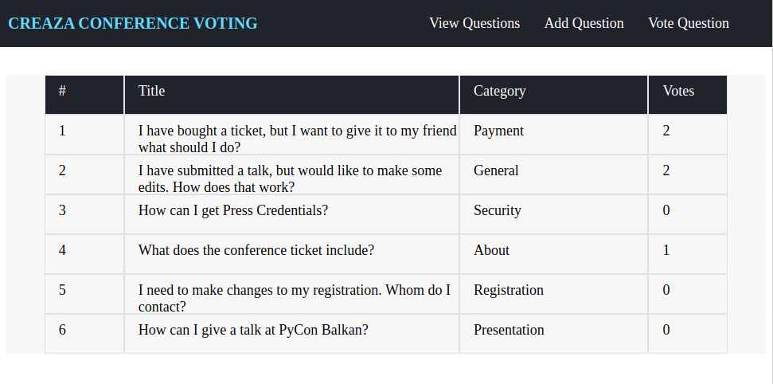
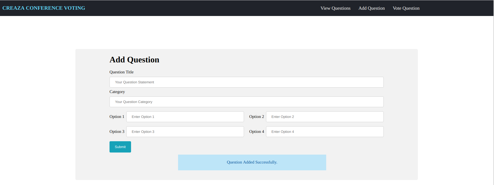
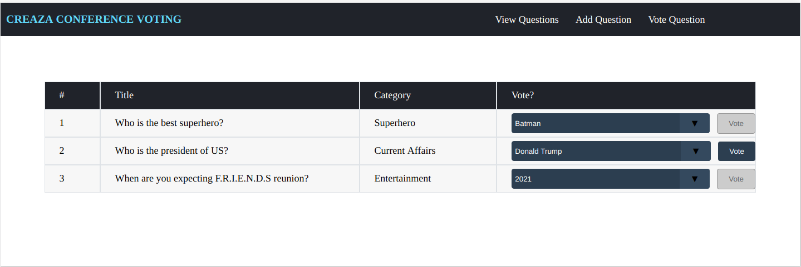
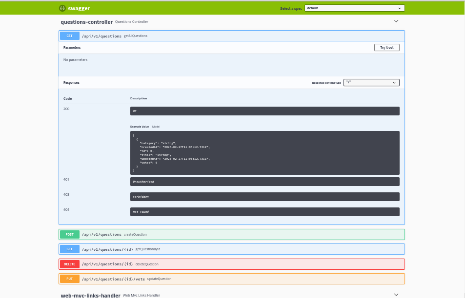

# conference vote over a question 

<h3 align="center">An application that will let participants at a conference vote over a question given by a speaker</h3>

## Technologies

- ### Back end

  - [Spring Boot](https://spring.io/projects/spring-boot/)- REST API using JAVA Spring Boot Framework
  - [MySQL](http://mysql.com/)- SQL database Storing Data
  - [Maven](http://maven.apache.org/)-- Maven as the build system


- ### Front end

  - [React](https://reactjs.org/) - JavaScript library for building user interfaces.
  - [React-router](https://github.com/ReactTraining/react-router)- Complete routing library for React
  - [npm](https://www.npmjs.com/) -Building the frontend Application 
 

 ## Building the Project

 ### Backend

 ```
 cd backend
 mvn clean install
 java -jar target/conference-voting-0.0.1-SNAPSHOT.jar
 ```

 This uses the port 8080.

 ### Frontend

```
cd frontend
npm install
npm start
```
This uses the port `3000`. So navigate to http://localhost:3000.

### Web pages




## Running Tests

In case if you like to run the tests alone, use the below Maven command -

```bash
mvn clean test
```

## API Documentation

Swagger is included in the project and hence to access the API Documentation, open http://localhost:8080/swagger-ui.html from the browser.
Example:-
